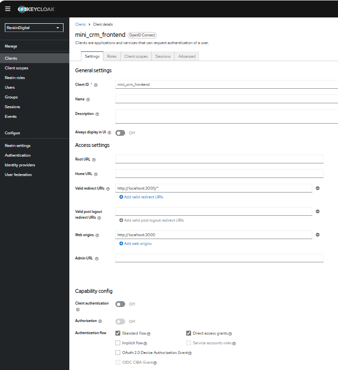

# RankinDigital React Frontend

This is the frontend application for the RankinDigital Mini CRM, developed using React. It provides a user interface for interacting with the CRM backend, integrates with Keycloak for authentication, and utilizes various UI libraries and components.

## Keycloak For frontend 

For the frontend client configuration in Keycloak, refer to the screenshot below for detailed setup instructions.



## Features

- **Authentication**: Integrated with Keycloak for secure authentication.
- **UI Components**: Utilizes Ant Design, Bootstrap, and React-Bootstrap for rich UI elements.
- **Data Visualization**: Includes Chart.js and React Big Calendar for displaying charts and calendars.
- **Date Handling**: Uses Moment.js for managing dates.

## Prerequisites

Ensure you have the following tools installed:

- **Node.js** (v16 or later)
- **npm** or **yarn** (npm is included with Node.js)

## Installation

1. **Clone the repository**:

   ```sh
   git clone https://github.com/your-repo/rankindigitalreact.git
   cd rankindigitalreact
## Installing dependencies 

Install dependencies:

Using npm:

```run
npm install
```

Or using yarn:

```run
yarn install
```

## Run 

Using npm:
```run
npm start
```
Or using yarn:
```run
yarn start
```


